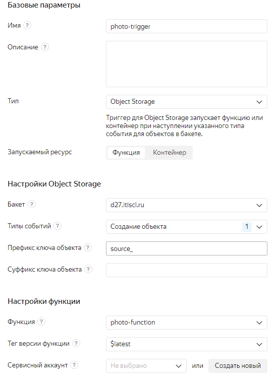

## Настройка

1. Создать облачную функцию
   
2. Скопировать данные из `main.py`

3. Задать переменные окружения 

   `API_KEY = API_KEY (Yandex Vision API key)`
   
   `AWS_ACCESS_KEY_ID = AWS_ACCESS_KEY_ID`
   
   `AWS_SECRET_ACCESS_KEY = AWS_SECRET_ACCESS_KEY`

4. Создать триггер для облачной функции

    Задать префикс ключа `source_`
    
    
   
5. Загрузить фотографию в бакет. Можно использовать из `images/source-images.jpg`
